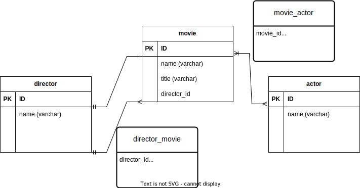

# Movies Schema Design

<h4>Problem statement </h4>

Each movie has a title and year, one (and only one) director, and some number of actors.

Actors can star in multiple movies

Directors can direct multiple movies.

Some movies have the same title such as Ocean’s Eleven (the 2001 version directed by Steven Sodenbergh had George Clooney, Brad Pitt, Matt Damon, Julia Roberts, and many others, but the 1960 version was directed by Lewis Milestone and starred Frank Sinatra, Dean Martin and Sammy Davis Jr).

The schema should be normalized enough to avoid duplicating strings too much, and also to be able to efficiently answer questions like these two: 

      <li> Who acted in Fight Club (1999)? </li>
      <li> What are the 10 most recent movies that George Clooney starred in?</li>

# solution
